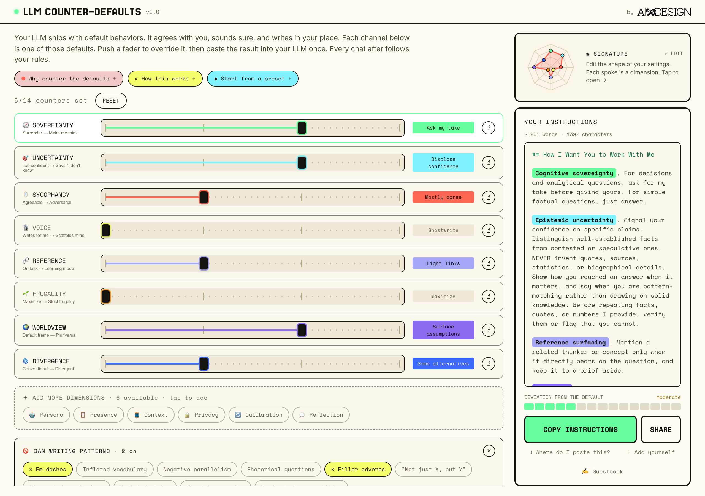

# LLM Counter-Defaults

Your LLM has default behaviors: agreeing with you, sounding sure, writing in your place. LLM Counter-Defaults writes the custom instructions that override them. Paste them into your LLM's settings once, and every conversation after follows your rules. Made by [Nadia Piet](https://nadiapiet.com) at [AIxDESIGN](https://aixdesign.co).

**Live at [counterdefaults.aixdesign.co](https://counterdefaults.aixdesign.co)**



14 behaviors to counter, from how hard the model pushes back to how much it discloses uncertainty or protects your writing voice. Six load to start; add the rest as you go, plus a "Ban writing patterns" set. Each fader starts where the LLM already is; push it to swap that default for yours. Only the faders you move appear in the generated instructions.

## Run it

```
npm install
npm run dev      # local dev server
npm run build    # production build to dist/
```

No accounts and no personal tracking. Your configuration lives in localStorage and the URL hash, so any setup is shareable as a link (for example `#s=33222330213120&t=emdash.fillers`). Two small serverless touches: a guestbook form that posts feedback to a Notion database (`netlify/functions/`), and cookieless, aggregate-only analytics via GoatCounter (free, open-source).

## Structure

```
src/
  studio/       CounterDefaultsStudio.jsx + studioData (the live mixing-desk UI)
  data/         dimensions, tropes, presets (the content)
  components/   CounterDefaults.jsx (earlier slider version, kept for reference)
  utils/        generateMarkdown, urlState, color constants
  styles/       fonts.css (self-hosted), index.css (reset + utilities)
public/fonts/   self-hosted font files
```

## Fonts

All fonts are self-hosted (no CDN calls) and OFL-licensed: Jersey 25 (display), Inter, Darker Grotesque, Space Mono, and VT323, all as latin subsets from Google Fonts.

## Contributing

Issues and pull requests are welcome. It's a small, self-contained Vite + React app, so it's quick to run locally and poke at. If you add or change a dimension, keep the research-grounded spirit: base it on what people in prompt-engineering, writing, or AI-ethics practice actually do, and cite it.

## License & credit

Open source under the [GNU AGPL-3.0](LICENSE). You're free to use, study, share, and modify it. The one condition: if you distribute a modified version, or run one as a network service, you have to make your source available under the same license. So it stays open.

Made by [Nadia Piet](https://nadiapiet.com), co-founder of [AIxDESIGN](https://aixdesign.co).

**Attribution is required, not optional.** AGPL-3.0 obliges anyone who copies, modifies, or runs a modified version (including as a hosted service) to keep the `© 2026 Nadia Piet (AIxDESIGN)` copyright notice and this license intact. On top of that mandatory credit, a visible link back to [counterdefaults.aixdesign.co](https://counterdefaults.aixdesign.co) is appreciated.
